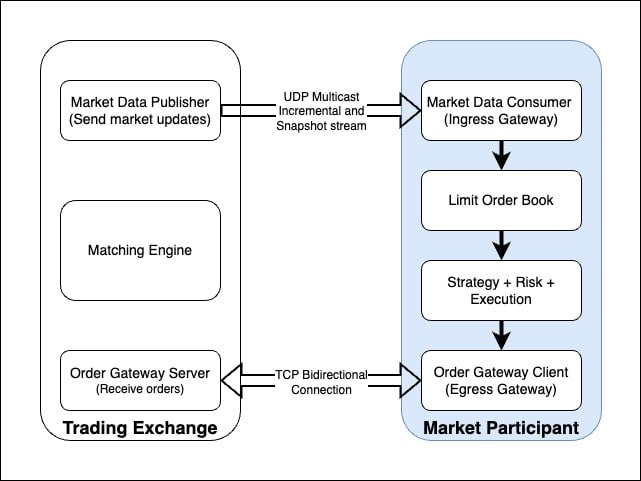

# Trading Engine

This project aims to build to end-to-end high level representation of a trading system, more specifically trading systems
traditionally used in High Frequency Trading (HFTs) firms hence latency should be prioritised. 

Trading Engine is developed in C++ (cpp). 


## Overall Architecture



HFT system consists of several key components that work together to enable rapid and automated trading.

1. Starting with the Ingress Gateway where market data first enters the system. These data is used to build the Orderbook
which is used to generate signals. Typically, in order to minimize network latency, HFT systems often rely on colocation services. 
More details such as UDP Multicast is described in [the readme for ingress gateway](ingressGateway/README.md) for gateway subdirectory.


2. Using update from exchanges, we can build our internal Orderbook. This orderbook contains the bids and asks from multiple 
venues. This is where we could optimise for speed by using the appropriate data structures. More details on the Orderbook 
is described in [the readme for orderbook](orderbook/README.md)


3. From the orderbook we could run our strategies to generate signals. One example of a strategy can be 
statistical arbitrage (stat arb) where it seeks to profit from 
temporary pricing inefficiencies or statistical relationships between financial instruments.


4. Depending on the strategy deployed, an execute order may be placed which will be sent to Order Manager System (OMS).
The OMS gathers orders submitted from the strategy.  
OMS may reject it for various reasons including too large a quantity, erroneous prices or excessive outstanding position.


5. Lastly the order is sent to the Egress Gateway to be sent to the respective exchanges.


## Repo Structure
```
├── CMakeLists.txt
├── main.cpp
├── ingressGateway
├── ├── ingressGateway_main.cpp  
├── ├── ... 
├── orderbook
├── ├── orderbook_main.cpp
├── ├── ...
├── 
```


