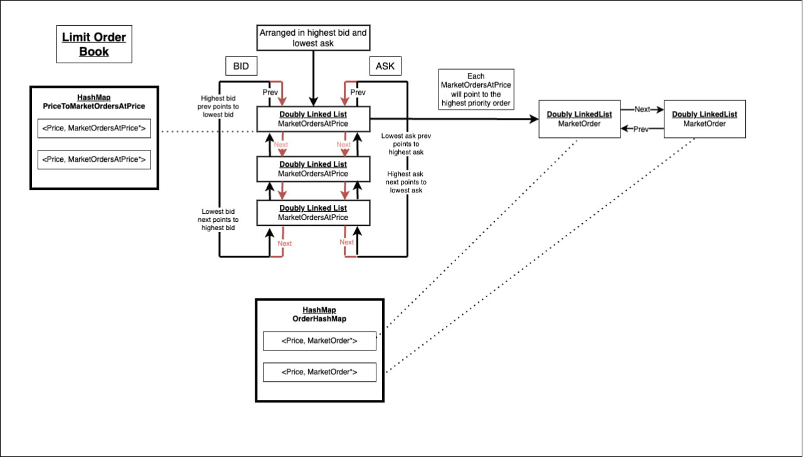

# Order Book
This is the bread and butter of a trading system. Every trading system must have their own order book obtained
using updates from exchanges.  

This order book is part of the trading system after data from exchanges enters via the Ingress Gateway
into our system. These market updates are used to generate for our Strategy Service to execute orders, which is sent
via the Egress Gateway. 

Areas of improvements are also listed below.

## Architecture

### Data Structure
(Will update)

An associative data structure std::map is used because it offers O(1) look up given the key 
and is naturally sorted allowing us to match orders easily and efficiently. 

There is both ASKs map and BIDs map, when printing the order book it will be from top down with the
highest ASK above and the lowest BID below. 

## Area of Improvements

1. In order to achieve better time complexity, an array may be considered with order ids to order meta data. 
Order metadata can include pointers to order book and price-level it belongs to. Making it only a O(1) deference away.

2. Include timestamps so that orders with same price can be sorted according to earlier orders. 

